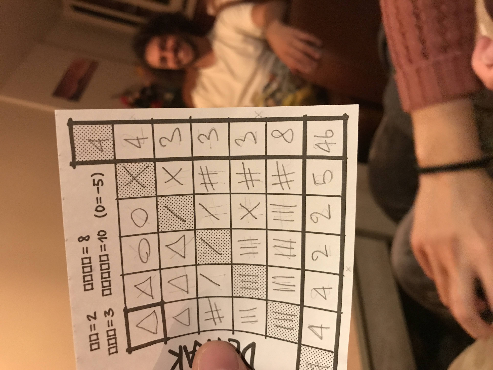

# Detrak optimal score

[Detrak](https://www.philibertnet.com/en/gigamic/73968-detrak-3421271117919.html) is a fun roll and write game. Every turn you throw a pair of dice to generate two symbols at random. The goal is the score points by placing symbols on a grid. The more adjacent symbols there are, the more points you score.

    

The question I'm looking to answer here is:

> ***What is the highest possible score if the sequence of symbols is known in advance?***
